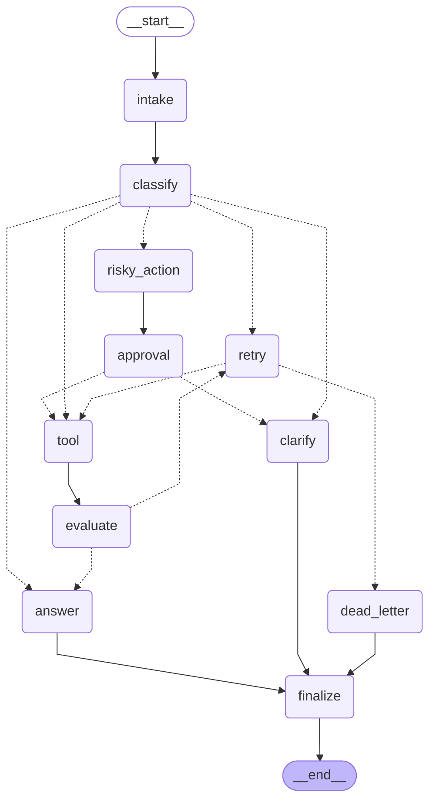

# Báo cáo Lab Ngày 08

## 1. Thành viên / Học viên

- Tên: Phạm Minh Hiếu
- Repo/commit: Day23-2A202600550-PhamMinhHieu
- Ngày thực hiện: 2026-06-29

## 2. Kiến trúc hệ thống

Hệ thống quy trình công việc (workflow) được xây dựng dưới dạng một `StateGraph` trạng thái bao gồm 11 nút (node) riêng biệt:
1. **`intake`**: Chuẩn hóa và làm sạch câu truy vấn thô của người dùng.
2. **`classify`**: Sử dụng LLM với cấu trúc đầu ra để phân loại tuyến đường (route) và xác định mức độ rủi ro của truy vấn.
3. **`tool`**: Thực thi các cuộc gọi công cụ (tool call) mô phỏng hoặc truy vấn, đồng thời mô phỏng các lỗi tạm thời.
4. **`evaluate`**: Đóng vai trò LLM-as-judge (kèm phương án dự phòng heuristic) để đánh giá kết quả từ công cụ là thành công hay cần thử lại.
5. **`answer`**: Tạo câu trả lời cuối cùng dựa trên các kết quả thu được từ công cụ/quy trình phê duyệt.
6. **`clarify`**: Tạo câu hỏi lịch sự để yêu cầu người dùng làm rõ thêm thông tin đối với các câu truy vấn mơ hồ.
7. **`risky_action`**: Mô tả chi tiết hành động nguy hiểm cần phê duyệt.
8. **`approval`**: Điểm chặn phê duyệt thực tế (Human-in-the-loop) sử dụng `interrupt()` hoặc tự động phê duyệt (mock).
9. **`retry`**: Tăng bộ đếm số lần thử lại và ghi nhận lỗi tạm thời.
10. **`dead_letter`**: Xử lý khi vượt quá số lần thử lại tối đa cho phép.
11. **`finalize`**: Ghi nhận sự kiện kiểm toán cuối cùng trước khi kết thúc quy trình.

## 3. State Schema (Lược đồ trạng thái)

| Trường | Bộ rút gọn (Reducer) | Mục đích sử dụng |
|---|---|---|
| messages | append (add) | Lưu lịch sử hội thoại/sự kiện |
| tool_results | append (add) | Lưu lịch sử kết quả của các công cụ |
| errors | append (add) | Theo dõi các thông báo lỗi |
| events | append (add) | Nhật ký hoạt động của các node |
| route | overwrite | Lưu trữ tuyến đường hiện tại |
| risk_level | overwrite | Mức độ rủi ro (low hoặc high) |
| attempt | overwrite | Đếm số lần thử lại |
| max_attempts | overwrite | Số lần thử lại tối đa cho phép |
| final_answer | overwrite | Lưu trữ câu trả lời cuối cùng |
| evaluation_result | overwrite | Điều kiện cổng thử lại (gating) |
| pending_question | overwrite | Câu hỏi làm rõ thông tin đang chờ |
| proposed_action | overwrite | Chi tiết hành động nguy hiểm đề xuất |
| approval | overwrite | Quyết định phê duyệt từ con người |

## 4. Kết quả các kịch bản (Scenario results)

### Chỉ số tổng hợp
- **Tổng số kịch bản**: 7
- **Tỷ lệ thành công**: 100.00%
- **Số nút trung bình đã đi qua**: 6.57
- **Tổng số lần thử lại (Retries)**: 4
- **Tổng số lần ngắt phê duyệt (Interrupts)**: 2

### Chi tiết từng kịch bản
| Kịch bản | Tuyến đường mong muốn | Tuyến đường thực tế | Thành công | Số lần thử lại | Số lần ngắt phê duyệt |
|---|---|---|---:|---:|---:|
| S01_simple | simple | simple | ✅ | 0 | 0 |
| S02_tool | tool | tool | ✅ | 0 | 0 |
| S03_missing | missing_info | missing_info | ✅ | 0 | 0 |
| S04_risky | risky | risky | ✅ | 0 | 1 |
| S05_error | error | error | ✅ | 3 | 0 |
| S06_delete | risky | risky | ✅ | 0 | 1 |
| S07_dead_letter | error | error | ✅ | 1 | 0 |

## 5. Phân tích lỗi (Failure analysis)

1. **Lỗi công cụ hoặc Thử lại**: Chúng tôi đã triển khai vòng lặp thử lại có giới hạn. Khi một công cụ gặp lỗi (ví dụ: lỗi timeout ở kịch bản S05), node đánh giá sẽ phát hiện lỗi và chuyển hướng đến node `retry`. Node retry tăng biến đếm số lần thử. Nếu `attempt >= max_attempts`, hệ thống sẽ chuyển hướng sang `dead_letter` để tránh vòng lặp vô hạn.
2. **Hành động nguy hiểm không có sự phê duyệt**: Các yêu cầu có tính chất phá hủy hoặc thay đổi dữ liệu lớn (như xóa tài khoản, hoàn tiền) được phân loại là `risky` và yêu cầu phê duyệt từ con người. Luồng xử lý sẽ bị ngắt tại node `approval`. Nếu bị từ chối, hệ thống sẽ chuyển sang node `clarify` thay vì chạy công cụ, đảm bảo an toàn hệ thống.

## 6. Minh chứng về tính Bền vững / Khôi phục trạng thái (Persistence / recovery)

Chúng tôi sử dụng bộ lưu vết `SqliteSaver` để lưu trạng thái trực tiếp vào cơ sở dữ liệu SQLite cục bộ. Mỗi lượt chạy sử dụng một `thread_id` duy nhất dựa trên ID kịch bản. Đối với luồng phê duyệt từ con người (HITL), trạng thái đồ thị được lưu tự động và tạm dừng. Khi người đánh giá cung cấp phản hồi, hệ thống sẽ khôi phục trực tiếp từ checkpoint đã lưu.

## 7. Phần mở rộng đã thực hiện (Extension work)

- **SQLite Checkpointer**: Triển khai lưu vết trạng thái bền vững sử dụng `langgraph-checkpoint-sqlite`.
- **LLM-as-judge**: Áp dụng mô hình LLM làm giám khảo trong `evaluate_node` để phân tích kết quả công cụ và quyết định xem có cần chạy lại hay không.
- **Sơ đồ đồ thị (Graph Diagram)**: Tự động kết xuất sơ đồ Mermaid trực quan hóa cấu trúc của đồ thị:

## 8. Kế hoạch cải tiến

Nếu có thêm thời gian, chúng tôi sẽ xây dựng một giao diện Streamlit trực quan để theo dõi luồng xử lý đồ thị theo thời gian thực, giám sát các checkpoint trạng thái, và cung cấp bảng điều khiển tương tác tiện lợi cho người phê duyệt.
